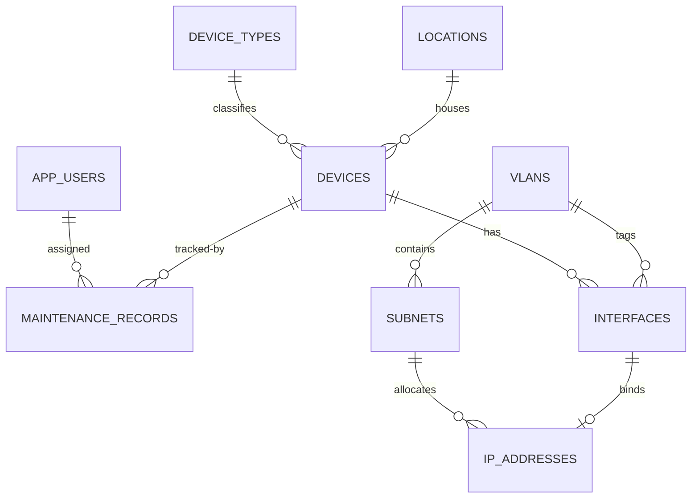

# NetManage

Network Infrastructure Management System for Northline University. A CRUD-only inventory of devices, interfaces, VLANs, subnets, IP addresses, locations, users, and maintenance records.

The application is a full-stack course project: PostgreSQL stores the relational model, Spring Boot exposes a REST API, and a Vite React console provides the operator UI.

## Tech stack

| Layer | Technology |
| --- | --- |
| Frontend | Vite, React, JavaScript, React Router |
| Backend | Java 17, Spring Boot 4.1.1, Maven |
| API | REST JSON (`@RestController`) |
| Persistence | Spring Data JPA / Hibernate |
| Validation | Jakarta Bean Validation |
| Database | PostgreSQL |

## Modules

| Module | Purpose |
| --- | --- |
| Dashboard | Record counts and navigation into CRUD modules |
| Users | System user records (`app_users`) and roles |
| Device Types | Categories such as Router and Switch |
| Locations | Buildings, floors, rooms, and MDF/IDF sites |
| Devices | Hostnames, serials, status, type, and location |
| Interfaces | Device ports, MAC addresses, optional VLAN |
| VLANs | VLAN numbers 1–4094 |
| Subnets | Network address, CIDR, mask, parent VLAN |
| IP Addresses | Allocated / available / reserved addresses |
| Maintenance | Work orders tied to a device and a user |

## CRUD mapped to REST

Every principal resource follows the same pattern.

| UI action | HTTP | Path example |
| --- | --- | --- |
| List records | `GET` | `/api/devices` |
| View one record | `GET` | `/api/devices/{id}` |
| Create from form | `POST` | `/api/devices` → `201 Created` |
| Save edits | `PUT` | `/api/devices/{id}` |
| Delete | `DELETE` | `/api/devices/{id}` → `204 No Content` |

Resources:

- `/api/users`
- `/api/device-types`
- `/api/locations`
- `/api/devices`
- `/api/interfaces`
- `/api/vlans`
- `/api/subnets`
- `/api/ip-addresses`
- `/api/maintenance`
- `/api/stats` (`GET` dashboard counts)

Validation failures return `400` with field messages. Deleting a parent that still has children, or violating a unique constraint, returns `409`. Missing IDs return `404`.

Foreign keys are chosen in the React forms with `<select>` lists loaded from the related endpoints.

## Entity-relationship diagram



See [docs/ER-DIAGRAM.md](docs/ER-DIAGRAM.md) for attributes and cardinality notes.

## Prerequisites

- Java 17+
- Maven 3.9+
- Node.js 18+ and npm
- PostgreSQL 14+ listening on `localhost:5432`

## PostgreSQL setup

Create the database (and a login if you are not using the default superuser):

```bash
sudo -u postgres psql -c "CREATE DATABASE netmanage;"
```

Connection used by the backend:

- host: `localhost`
- port: `5432`
- database: `netmanage`
- user: `postgres`
- password: `postgres`

You can let Hibernate create tables (`spring.jpa.hibernate.ddl-auto=update`) and let `DataSeeder` insert the Northline University sample rows on first start.

Alternatively apply the SQL scripts:

```bash
psql -U postgres -d postgres -f database/schema.sql
psql -U postgres -d netmanage -f database/seed.sql
```

`schema.sql` includes `CREATE DATABASE` / `\c netmanage`. If the database already exists, skip that file's first two lines and run the `CREATE TABLE` statements against `netmanage`. If you load `seed.sql` first, the Java seeder detects existing users and does not insert duplicates.

## Backend

```bash
cd backend
mvn spring-boot:run
```

API base: [http://localhost:8081/api](http://localhost:8081/api)

CORS allows the Vite dev origin `http://localhost:5173`.

This project does not ship the Maven wrapper. Use a local Maven installation (`mvn`).

## Frontend

```bash
cd frontend
npm install
npm run dev
```

UI: [http://localhost:5173](http://localhost:5173)

The client calls `import.meta.env.VITE_API_URL` when set, otherwise `http://localhost:8081/api`.

Production build:

```bash
cd frontend
npm run build
```

## Project layout

```
course-project/
  backend/          Spring Boot Maven application
  frontend/         Vite + React console
  database/         schema.sql and seed.sql
  docs/             ER diagram
```

## Scope

NetManage is an information-management system. It does not poll devices, push configurations, calculate routes, or open TCP control sockets. Networking concepts appear in the data model and sample records only.
